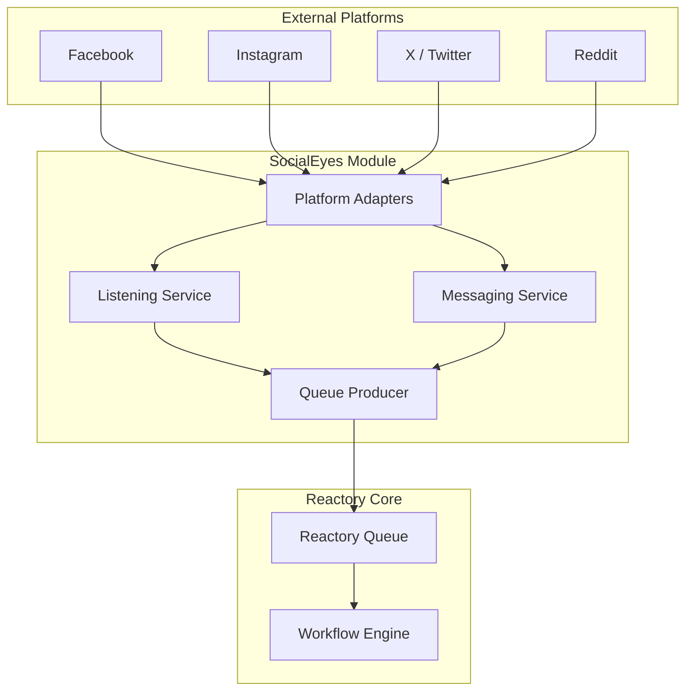

# Reactory SocialEyes Module Specification

## 1. Overview

The Reactory SocialEyes module is a centralized social media connectivity and intelligence system designed to integrate Reactory applications with various social media platforms. It enables automated monitoring, interaction, and data extraction across multiple networks including Instagram, Facebook, X (Twitter), Reddit, and others.

### 1.1 Purpose

The module serves to:
- Connect and authenticate with multiple social media platforms.
- Monitor streams for specific keywords, user tags, and group mentions.
- Facilitate direct communication via Direct Messages (DMs).
- Automate support workflows by raising tickets on supported platforms.
- Extract signals and messages to trigger Reactory Workflows via the Queue system.

### 1.2 Key Features

- **Multi-Platform Adapters**: Unified interface for connecting to Instagram, Facebook, X, Reddit, LinkedIn, etc.
- **Social Listening**: Configurable "Listeners" to search for keywords, hashtags, @mentions, or group activity.
- **Unified Messaging**: Read and send Direct Messages (DMs) across platforms through a normalized API.
- **Support Integration**: Ability to file support requests or report content on platforms where APIs allow.
- **Event-Driven Architecture**: Publishes events to `reactory-queue` based on detected signals (e.g., specific keywords found).
- **Workflow Triggers**: Automatically initiate Reactory business workflows based on social media events.
- **Data Harvesting**: Extract and normalize posts and messages for storage and analysis.

## 2. Architecture

### 2.1 High-Level Architecture

The module uses a provider pattern to abstract platform-specific APIs, normalizing data into Reactory structures before processing or storage.



### 2.2 Module Structure

```
reactory-socialeyes/
├── index.ts                    # Module definition
├── package.json               # Dependencies
├── specification.md            # This document
│
├── adapters/                  # Platform-specific implementations
│   ├── index.ts
│   ├── base.ts                # Abstract provider class
│   ├── instagram/
│   ├── facebook/
│   ├── x/
│   └── reddit/
│
├── services/                  # Core business logic
│   ├── SocialEyesService.ts   # Main orchestration
│   ├── ListeningService.ts    # Search and monitoring logic
│   ├── MessagingService.ts    # DM handling
│   └── SupportService.ts      # Platform support requests
│
├── models/                    # Data models
│   ├── Account.ts             # Social media account config
│   ├── Listener.ts            # Configuration for keyword monitoring
│   ├── Post.ts                # Normalized post data
│   └── Message.ts             # Normalized direct message
│
├── events/                    # Event definitions
│   └── index.ts
│
└── cli/                       # CLI tools
    ├── index.ts
    └── monitor.ts             # CLI to run listeners manually
```

### 2.3 Integration with Reactory

The module relies on the following core modules:
- **reactory-core**: For base types, user management, and security.
- **reactory-queue**: For publishing detected events (`SocialEyes.PostDetected`, `SocialEyes.MessageReceived`).
- **reactory-workflow**: Workflows subscribe to these queue events to trigger business logic (e.g., "Create Lead from Tweet").

### 2.4 Built-in Workflows

The SocialEyes module provides a comprehensive set of pre-built workflows for common automation scenarios. These workflows leverage the Reactory Workflow Engine and can be executed as TypeScript classes or declaratively using YAML definitions.

**See [Built-in Workflows Documentation](./workflow-builtin.md) for detailed specifications including:**

1. **Direct Message Processing Workflow** (`socialeyes.ProcessDirectMessages@1.0.0`)
   - AI-powered DM handling and automated response generation
   - Hybrid mode with human-in-the-loop approval
   - Support ticket escalation for complex queries

2. **Content Takedown Workflow** (`socialeyes.ContentTakedown@1.0.0`)
   - Automated impersonation and violation reporting
   - Evidence collection and archival
   - Platform submission and tracking

3. **Social Listening Orchestration Workflow** (`socialeyes.SocialListeningOrchestration@1.0.0`)
   - Multi-platform monitoring coordination
   - Trend analysis and aggregation
   - Action rule processing

4. **Sentiment Analysis Pipeline Workflow** (`socialeyes.SentimentAnalysisPipeline@1.0.0`)
   - Batch sentiment analysis
   - Topic extraction and categorization
   - Alert generation for sentiment anomalies

These workflows integrate seamlessly with the module's adapters, services, and event system to provide turnkey automation capabilities.

## 3. Functional Requirements

### 3.1 Social Listening
The system shall support "Listeners"—configurations that define:
- **Platform**: Target platform (e.g., X, Reddit).
- **Type**: Keyword, Hashtag, User Mention, Group.
- **Query**: The actual search definition.
- **Interval**: How often to poll (if no webhook available).
- **Actions**: Immediate actions (e.g., "Like", "Reply", "Emit Event").

### 3.2 Direct Messaging
- **Inbox Sync**: Retrieve DMs from connected accounts.
- **Send Message**: Send text, media, or structured messages to users.
- **Unified Inbox**: A GraphQL resolver providing a merged view of conversations across platforms.

### 3.3 Support Integration
- Standardized API to `raiseSupportTicket(platform, context)` where the platform supports it (e.g., reporting a violation, asking for help).

### 3.4 Events & Workflows
- **Keyword Match**: specific terms publish message to queue.
- Events must include normalized payload:
  ```typescript
  interface SocialEventPayload {
    platform: string;
    sourceId: string;
    actor: { id: string; handle: string; name: string };
    content: string;
    media: string[];
    timestamp: Date;
    metadata: any;
  }
  ```

## 4. API & GraphQL Interfaces

### 4.1 Queries
- `socialEyesAccounts`: List connected accounts.
- `socialEyesListeners`: List active monitoring configs.
- `socialEyesFeed(filter)`: Get normalized feed of collected posts.
- `socialEyesInbox`: Get unified messages.

### 4.2 Mutations
- `socialEyesConnectAccount(platform, credentials)`: OAuth flow or credential storage.
- `socialEyesCreateListener(input)`: Set up a new monitor.
- `socialEyesSendMessage(input)`: Send a DM.
