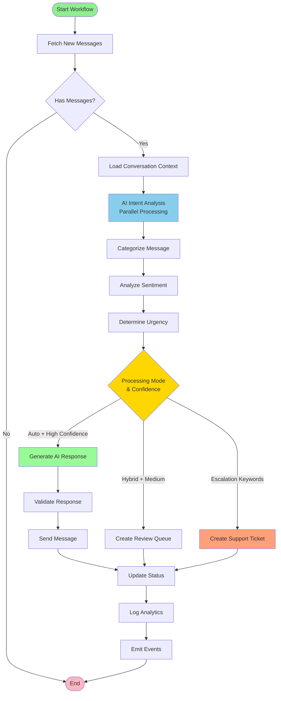
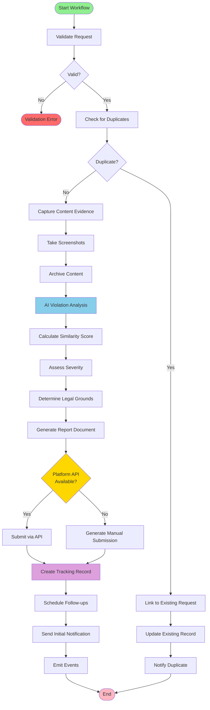
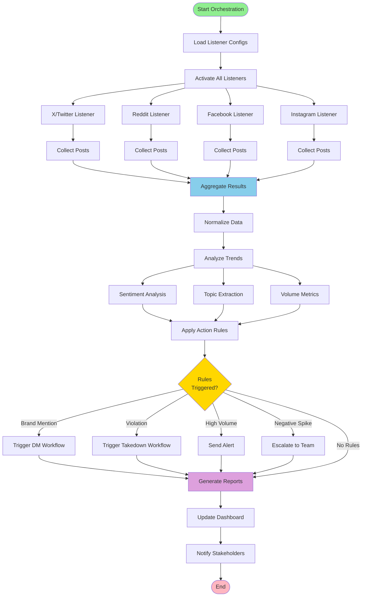
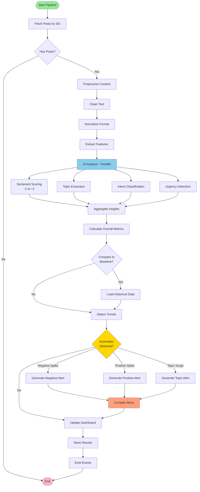

# SocialEyes Built-in Workflows

This document defines the built-in workflows provided by the Reactory SocialEyes module. These workflows leverage the Reactory Workflow Engine and can be executed either as TypeScript classes (StepBody-based) or declaratively using YAML definitions.

## Overview

The SocialEyes module provides pre-built workflows for common social media automation tasks including:

1. **Direct Message Processing** - AI-powered DM handling and response generation
2. **Content Takedown Management** - Automated impersonation and violation reporting
3. **Social Listening Orchestration** - Coordinated multi-platform monitoring
4. **Sentiment Analysis Pipeline** - Batch sentiment analysis for collected posts

---

## 1. Direct Message Processing Workflow

### Purpose
Automatically process incoming direct messages across social media platforms using AI agents to understand intent, formulate appropriate responses, and either auto-respond or escalate to human operators.

### Workflow ID
`socialeyes.ProcessDirectMessages@1.0.0`

### Description
This workflow monitors connected social media accounts for new direct messages, uses AI to analyze the message content, determines the appropriate response strategy, and either sends an automated reply or creates a support ticket for human intervention.

### Workflow Diagram



### Input Parameters

```yaml
inputs:
  accountId:
    type: string
    required: true
    description: The social account ID to monitor for messages
    
  platform:
    type: string
    required: true
    enum: ['x', 'reddit', 'facebook', 'instagram']
    description: The social media platform
    
  processingMode:
    type: string
    required: false
    default: 'hybrid'
    enum: ['auto', 'hybrid', 'manual']
    description: |
      - auto: AI handles all responses automatically
      - hybrid: AI suggests responses, human approves
      - manual: All messages escalated to human operators
      
  conversationContext:
    type: object
    required: false
    description: Previous conversation history for context
    
  responseGuidelines:
    type: object
    required: false
    description: Brand voice and response guidelines
    properties:
      tone: 
        type: string
        enum: ['professional', 'friendly', 'casual', 'formal']
        default: 'professional'
      maxResponseLength:
        type: number
        default: 280
      escalationKeywords:
        type: array
        items: string
        description: Keywords that trigger human escalation
        default: ['refund', 'complaint', 'legal', 'urgent']
      autoResponseCategories:
        type: array
        items: string
        description: Message categories safe for auto-response
        default: ['greeting', 'faq', 'information-request']
        
  aiConfig:
    type: object
    required: false
    description: AI agent configuration
    properties:
      model:
        type: string
        default: 'gpt-4'
      temperature:
        type: number
        default: 0.7
      maxTokens:
        type: number
        default: 500
```

### Output Parameters

```yaml
outputs:
  processedMessages:
    type: array
    description: List of processed message IDs
    
  responsesSent:
    type: array
    description: Responses sent automatically
    items:
      messageId: string
      responseText: string
      timestamp: date
      
  escalatedMessages:
    type: array
    description: Messages escalated to human operators
    items:
      messageId: string
      reason: string
      priority: string
      ticketId: string
      
  processingStats:
    type: object
    properties:
      totalProcessed: number
      autoResponded: number
      escalated: number
      avgResponseTime: number
      avgConfidenceScore: number
```

### Workflow Steps

#### Step 1: Fetch New Messages
- **Type**: `apiCall`
- **Action**: Retrieve unread DMs from the specified account
- **Service**: `MessagingService.getMessages()`
- **Output**: List of unread messages

#### Step 2: Initialize Conversation Context
- **Type**: `custom`
- **Action**: Load conversation history for each message
- **Service**: `MessagingService.getConversation()`
- **Output**: Enriched messages with context

#### Step 3: AI Intent Analysis (Parallel)
- **Type**: `parallel` - Process multiple messages concurrently
- **Action**: For each message, use AI to determine:
  - Message category (greeting, question, complaint, etc.)
  - Sentiment (positive, negative, neutral)
  - Intent (information, support, sales, etc.)
  - Urgency level
  - Confidence score
- **Service**: `ReactorService` AI conversation
- **Output**: Message analysis results

#### Step 4: Decision Routing
- **Type**: `conditional`
- **Condition**: Based on processing mode and AI analysis
- **Branches**:
  - **Auto Response Path**: High confidence + allowed category
  - **Human Review Path**: Medium confidence or hybrid mode
  - **Escalation Path**: Low confidence or contains escalation keywords

#### Step 5a: Generate AI Response (Auto Path)
- **Type**: `custom`
- **Action**: Use AI to generate contextually appropriate response
- **Service**: `ReactorService`
- **Validation**: Check against brand guidelines and length limits
- **Output**: Draft response text

#### Step 5b: Create Review Queue (Hybrid Path)
- **Type**: `custom`
- **Action**: Store message and suggested response for human review
- **Service**: Queue to review system
- **Output**: Review queue item ID

#### Step 5c: Create Support Ticket (Escalation Path)
- **Type**: `apiCall`
- **Action**: Create support ticket in ticketing system
- **Priority**: Based on urgency analysis
- **Output**: Ticket ID and assignment

#### Step 6: Send Response (Auto Path)
- **Type**: `custom`
- **Action**: Send AI-generated response via platform adapter
- **Service**: Platform adapter `sendMessage()`
- **Retry**: 3 attempts with exponential backoff
- **Output**: Sent message ID

#### Step 7: Update Message Status
- **Type**: `custom`
- **Action**: Mark messages as processed/responded/escalated
- **Service**: `SocialMessage.updateStatus()`
- **Output**: Updated status count

#### Step 8: Log Analytics
- **Type**: `custom`
- **Action**: Record processing metrics and analytics
- **Service**: Analytics service
- **Output**: Processing statistics

#### Step 9: Emit Events
- **Type**: `event`
- **Events**:
  - `SocialEyes.MessageProcessed` - For all processed messages
  - `SocialEyes.AutoResponseSent` - For automated responses
  - `SocialEyes.MessageEscalated` - For escalated messages

### Configuration

```yaml
config:
  timeout: 300000  # 5 minutes
  retryPolicy:
    maxAttempts: 3
    backoffStrategy: exponential
  concurrency:
    maxParallel: 10  # Process up to 10 messages concurrently
  monitoring:
    enableMetrics: true
    logLevel: 'info'
```

### Events Triggered

- `SocialEyes.MessageProcessed`
- `SocialEyes.AutoResponseSent`
- `SocialEyes.MessageEscalated`
- `SocialEyes.ConversationUpdated`

### Dependencies

- `MessagingService` - Message retrieval and sending
- `ReactorService` - AI processing and response generation
- `SocialAccount` model - Account credentials
- `SocialMessage` model - Message storage
- Platform adapters (X, Reddit, etc.)

### Example YAML Definition

```yaml
nameSpace: socialeyes
name: ProcessDirectMessages
version: 1.0.0
description: AI-powered direct message processing and response workflow

inputs:
  accountId:
    type: string
    required: true
  platform:
    type: string
    required: true
    enum: ['x', 'reddit', 'facebook', 'instagram']
  processingMode:
    type: string
    default: 'hybrid'

variables:
  messages: []
  processedCount: 0

steps:
  - id: fetchMessages
    name: Fetch New Messages
    type: custom
    config:
      service: MessagingService
      method: getMessages
      params:
        accountId: "${input.accountId}"
        since: "${workflow.lastRun}"
        
  - id: analyzeIntent
    name: AI Intent Analysis
    type: parallel
    dependsOn: fetchMessages
    forEach: "${step.fetchMessages.messages}"
    config:
      service: ReactorService
      method: analyzeMessage
      
  # ... additional steps as defined above
```

---

## 2. Content Takedown Workflow

### Purpose
Automate the process of identifying, reporting, and tracking takedown requests for impersonation, copyright violations, or other policy violations across social media platforms.

### Workflow ID
`socialeyes.ContentTakedown@1.0.0`

### Description
This workflow handles the complete lifecycle of content takedown requests, from detection and validation through reporting to the platform and tracking resolution status. It supports both manual reports and automated detection of violations.

### Workflow Diagram



### Input Parameters

```yaml
inputs:
  platform:
    type: string
    required: true
    enum: ['x', 'reddit', 'facebook', 'instagram']
    description: Target platform for takedown
    
  targetContent:
    type: object
    required: true
    description: Content to be taken down
    properties:
      contentType:
        type: string
        enum: ['post', 'account', 'comment', 'message']
      contentId:
        type: string
        description: Platform-specific content ID
      url:
        type: string
        description: Direct URL to content
        
  violationType:
    type: string
    required: true
    enum: ['impersonation', 'copyright', 'trademark', 'harassment', 'spam', 'other']
    description: Type of violation
    
  reportingAccount:
    type: string
    required: true
    description: Account ID filing the report
    
  evidence:
    type: object
    required: true
    description: Evidence supporting the takedown request
    properties:
      screenshots:
        type: array
        items: string
        description: URLs to screenshot evidence
      originalContent:
        type: string
        description: URL to original/authentic content
      description:
        type: string
        description: Detailed explanation of violation
      additionalUrls:
        type: array
        items: string
        description: Related violating content
        
  urgency:
    type: string
    required: false
    default: 'normal'
    enum: ['low', 'normal', 'high', 'critical']
    description: Priority level for processing
    
  notificationPreferences:
    type: object
    required: false
    description: How to notify about status updates
    properties:
      email:
        type: boolean
        default: true
      sms:
        type: boolean
        default: false
      webhook:
        type: string
        description: Webhook URL for status updates
```

### Output Parameters

```yaml
outputs:
  takedownRequestId:
    type: string
    description: Internal tracking ID for this request
    
  platformReferenceId:
    type: string
    description: Platform-provided reference ID
    
  status:
    type: string
    enum: ['submitted', 'under-review', 'approved', 'rejected', 'completed']
    description: Current status of takedown request
    
  timeline:
    type: array
    description: Timeline of actions taken
    items:
      timestamp: date
      action: string
      actor: string
      notes: string
      
  resolution:
    type: object
    description: Final resolution details
    properties:
      resolved: boolean
      resolutionDate: date
      outcome: string
      platformResponse: string
```

### Workflow Steps

#### Step 1: Validate Request
- **Type**: `validation`
- **Action**: Validate all required fields and evidence
- **Rules**:
  - Content ID or URL must be provided
  - Evidence must include at least one item
  - Reporting account must be verified
- **Output**: Validation result

#### Step 2: Check for Duplicates
- **Type**: `custom`
- **Action**: Check if this content has already been reported
- **Service**: Database query against takedown requests
- **Output**: Duplicate check result

#### Step 3: Capture Content Evidence
- **Type**: `custom`
- **Action**: Archive current state of violating content
- **Services**:
  - Screenshot service
  - Web archive service
  - Platform adapter to fetch content details
- **Output**: Archived evidence URLs

#### Step 4: Enrich with AI Analysis
- **Type**: `custom`
- **Action**: Use AI to analyze violation and strengthen case
- **Service**: `ReactorService`
- **Analysis**:
  - Similarity score (for impersonation)
  - Content classification
  - Violation severity assessment
  - Suggested legal grounds
- **Output**: AI analysis report

#### Step 5: Generate Report Document
- **Type**: `custom`
- **Action**: Create formal takedown request document
- **Template**: Platform-specific report format
- **Includes**:
  - Violation details
  - Evidence compilation
  - Legal basis
  - Contact information
- **Output**: Report document (PDF/HTML)

#### Step 6: Submit to Platform
- **Type**: `apiCall`
- **Action**: Submit takedown request via platform API or form
- **Service**: Platform adapter `submitTakedownRequest()`
- **Branches**:
  - **API Available**: Use platform API
  - **Manual Required**: Generate email/form submission
- **Retry**: 3 attempts
- **Output**: Platform submission confirmation

#### Step 7: Create Tracking Record
- **Type**: `custom`
- **Action**: Store request in database with tracking ID
- **Service**: Database service
- **Output**: Takedown request record

#### Step 8: Schedule Follow-up
- **Type**: `schedule`
- **Action**: Create scheduled checks for status updates
- **Schedule**: 
  - Day 1: Initial confirmation
  - Day 3: First follow-up
  - Day 7: Second follow-up
  - Day 14: Final follow-up
- **Output**: Scheduled task IDs

#### Step 9: Send Initial Notification
- **Type**: `notification`
- **Action**: Notify requester of submission
- **Channels**: Based on preferences (email, SMS, webhook)
- **Output**: Notification delivery status

#### Step 10: Emit Events
- **Type**: `event`
- **Events**:
  - `SocialEyes.TakedownSubmitted`
  - `SocialEyes.ContentArchived`

### Configuration

```yaml
config:
  timeout: 600000  # 10 minutes
  retryPolicy:
    maxAttempts: 3
    backoffStrategy: exponential
  storage:
    evidenceRetention: 365  # days
    archiveLocation: 's3://takedown-evidence/'
  monitoring:
    enableMetrics: true
    alertOnFailure: true
```

### Follow-up Workflow

A companion workflow `socialeyes.TakedownFollowUp@1.0.0` handles:
- Periodic status checks with platform
- Automatic status updates
- Escalation for delayed responses
- Resolution confirmation
- Metrics and reporting

### Events Triggered

- `SocialEyes.TakedownSubmitted`
- `SocialEyes.ContentArchived`
- `SocialEyes.TakedownStatusChanged`
- `SocialEyes.TakedownResolved`

### Dependencies

- Platform adapters - For content access and report submission
- `ReactorService` - AI analysis
- Storage service - Evidence archival
- Notification service - Status updates
- Screenshot/archive service - Evidence capture

### Example YAML Definition

```yaml
nameSpace: socialeyes
name: ContentTakedown
version: 1.0.0
description: Automated content takedown request workflow

inputs:
  platform:
    type: string
    required: true
  targetContent:
    type: object
    required: true
  violationType:
    type: string
    required: true

variables:
  evidenceUrls: []
  reportDocument: null
  trackingId: null

steps:
  - id: validateRequest
    name: Validate Takedown Request
    type: validation
    config:
      rules:
        - field: targetContent.contentId
          required: true
        - field: evidence
          minItems: 1
          
  - id: captureEvidence
    name: Archive Evidence
    type: custom
    dependsOn: validateRequest
    config:
      services:
        - screenshotService
        - webArchive
        
  # ... additional steps as defined above
```

---

## 3. Social Listening Orchestration Workflow

### Purpose
Coordinate multi-platform social listening activities, aggregate results, analyze trends, and trigger appropriate actions based on detected patterns or keywords.

### Workflow ID
`socialeyes.SocialListeningOrchestration@1.0.0`

### Description
This meta-workflow orchestrates multiple listening activities across platforms, provides unified reporting, and can trigger child workflows based on detected events (e.g., trigger DM processing when brand mention is detected).

### Workflow Diagram



### Input Parameters

```yaml
inputs:
  listeners:
    type: array
    required: true
    description: List of listener configurations
    items:
      listenerId: string
      platform: string
      enabled: boolean
      
  aggregationPeriod:
    type: string
    default: '1h'
    enum: ['15m', '30m', '1h', '6h', '24h']
    description: How often to aggregate and report
    
  actionRules:
    type: array
    description: Rules for triggering actions
    items:
      condition: string
      action: string
      params: object
      
  reporting:
    type: object
    properties:
      enableDashboard: boolean
      emailReports: array
      slackChannel: string
```

### Workflow Steps

1. **Activate Listeners** - Start all configured listeners
2. **Monitor Collection** - Track listener activity and results
3. **Aggregate Results** - Combine posts/messages from all platforms
4. **Analyze Trends** - Identify patterns, sentiment trends, emerging topics
5. **Apply Action Rules** - Check conditions and trigger workflows
6. **Generate Reports** - Create summary reports and dashboards
7. **Notify Stakeholders** - Send reports to configured channels

---

## 4. Sentiment Analysis Pipeline Workflow

### Purpose
Batch process collected social media posts to analyze sentiment, extract insights, and identify trending topics or issues requiring attention.

### Workflow ID
`socialeyes.SentimentAnalysisPipeline@1.0.0`

### Description
Processes batches of social media posts through AI-powered sentiment analysis, categorization, and trend detection. Results feed into reporting dashboards and can trigger alerts for negative sentiment spikes.

### Workflow Diagram



### Input Parameters

```yaml
inputs:
  postIds:
    type: array
    required: true
    description: IDs of posts to analyze
    
  analysisDimensions:
    type: array
    default: ['sentiment', 'topics', 'intent', 'urgency']
    items: string
    
  brandKeywords:
    type: array
    description: Keywords related to brand for context
    
  compareBaseline:
    type: boolean
    default: true
    description: Compare against historical baseline
```

### Workflow Steps

1. **Fetch Posts** - Retrieve post content and metadata
2. **Preprocess Content** - Clean and normalize text
3. **AI Analysis (Parallel)** - Analyze each post for:
   - Sentiment score (-1 to 1)
   - Topics and themes
   - Intent classification
   - Urgency/priority
4. **Aggregate Insights** - Compile overall metrics
5. **Trend Detection** - Identify patterns and anomalies
6. **Generate Alerts** - Create alerts for significant findings
7. **Update Dashboard** - Refresh real-time analytics
8. **Store Results** - Save analysis to database

---

## Common Workflow Patterns

### Error Handling

All workflows implement standardized error handling:

```yaml
errorHandling:
  onError:
    - log:
        level: error
        message: "${error.message}"
    - emit:
        event: "SocialEyes.WorkflowError"
        payload: "${error}"
    - retry:
        maxAttempts: 3
        backoffStrategy: exponential
  onTimeout:
    - notify:
        channel: ops-alerts
        message: "Workflow ${workflow.id} timed out"
```

### Monitoring and Metrics

All workflows emit standardized metrics:

- Execution time
- Step completion rates
- Error rates
- Resource utilization
- Business metrics (messages processed, takedowns submitted, etc.)

### Security and Compliance

All workflows enforce:

- Authentication and authorization checks
- Data encryption in transit and at rest
- Audit logging
- Compliance with platform ToS
- Rate limiting and quota management

---

## Workflow Composition

These workflows can be composed and chained:

### Example: End-to-End Brand Protection

```yaml
name: BrandProtectionSuite
description: Complete brand protection workflow

workflow:
  - trigger: schedule
    cron: "*/15 * * * *"  # Every 15 minutes
    
  - step: runListening
    workflow: socialeyes.SocialListeningOrchestration
    
  - step: processDMs
    workflow: socialeyes.ProcessDirectMessages
    condition: "${step.runListening.hasNewMessages}"
    
  - step: checkViolations
    custom: detectImpersonation
    
  - step: submitTakedowns
    workflow: socialeyes.ContentTakedown
    forEach: "${step.checkViolations.violations}"
    
  - step: analyzeSentiment
    workflow: socialeyes.SentimentAnalysisPipeline
    inputs:
      postIds: "${step.runListening.newPostIds}"
```

---

## Extension Points

Each workflow provides extension points for custom logic:

1. **Custom Steps** - Add organization-specific processing
2. **Event Handlers** - React to workflow events
3. **Validators** - Custom validation logic
4. **Formatters** - Custom output formatting
5. **Integrations** - Connect to external systems

---

## Next Steps

To implement these workflows:

1. Create TypeScript StepBody classes for each workflow step
2. Implement YAML parsers/builders for declarative definitions
3. Build workflow testing framework
4. Create monitoring dashboards
5. Document API and integration patterns
6. Provide example configurations for common scenarios
